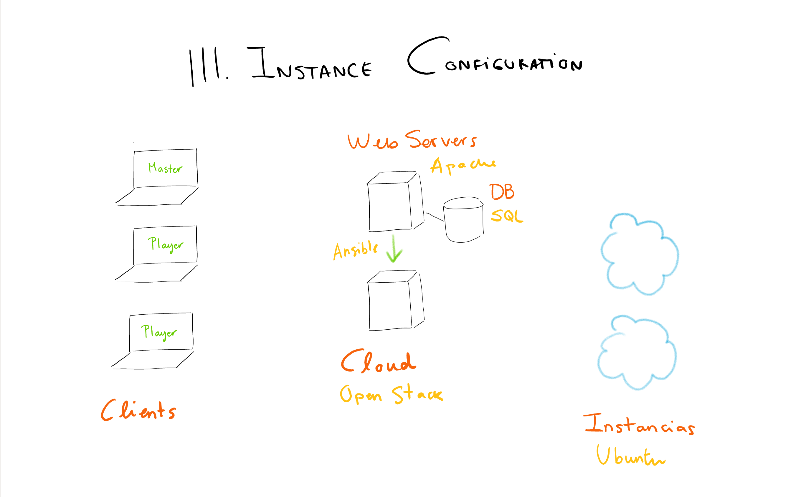

# Dungeons & Dragons as a Service

 

Dungeons & Dragons as a Service is born to pave the way for fast and automated 21st-century role-game campaign creation and configuration. DaaS works as a framework in which one can quickly start playing D&D in a Cloud instance automatically launched by the service, already configured for a _launch-and-play_ experience.

## The Infrastructure
The cloud infrastructure we created can be summarized in this diagram:

Or:
- A Debian Web Server
  * Clients use it as a frontend
  * Manages the CentoOS server via Ansible
  * Manages the Ubuntu instances via Ansible
- A CentOS OpenStack server
  * Deploys ubuntu instances

## The Web Server
The [web server](Web%20API/server.py) is the frontend for our users, this is where each campaign is configured and the characters are created by the players. When everything is ready, the dungeon master creates a campaign and the instance configuration starts.

This web server is a REST API running in Flask and MySQL and it's also responsible for all the ansible playbooks and the ansible inventory. You can read how we handle this in [ansible_helper.py](Web%20API/ansible_helper.py).

## OpenStack and the instance deployment
The used OpenStack implementation is [Devstack](https://docs.openstack.org/devstack/latest/) for its simplicity and the fact that it only needs one server to run (one ~~fucking~~ big server is still one server after all).

When the dungeon master creates a campaign, the web server signals the OpenStack server to deploy a new Ubuntu instance and to publish the SSH port to it. In order to do so, the next ansible playbook is executed from the web server: [deploy.yml](Web%20API/ansible/deploy.yml) which runs this bash script in the CentOS OpenStack server: [deploy.sh](Scripts/deploy.sh).

The Ubuntu instances have already been configured to run a OpenSSH server at start and to include spell file system structure that is needed to play the game. In this file structure, spells are organized as files in a file tree separating character classes and levels, this file structure allows us to configure the access of each spell based in the attributes of the users using Access Control Lists and Unix file permissions. 

The file structure can be configured using these python script [create_file_system.py](Scripts/spells_roles/create_file_system.py) which runs [get_spells_with_roles.py](Scripts/spells_roles/get_spells_with_roles.py) and [get_spells_by_class.py](Scripts/spells_roles/get_spells_by_class.py) in this order.

After deploying the new ubuntu instance, [deploy.sh](Scripts/deploy.sh) returns it's ip address and SSH port so that it can be added to the Ansible inventory for further configurations and updates.

## Ansible ~and the hell of linking everything together~
As mentioned before, the web server uses Ansible to tell the OpenStack server to launch a new instance to host the new campaign. This Cloud Campaign will start with a given file structure but it will need further configurations to be actually usable. To do so, this new instance will be remotely configured via Ansible with the [instance_config.yml](Web%20API/ansible/instance_config.yml) playbook.

With this playbook:
- The class groups will be created (Wizard, Warlock, Ranger...) - [The playbook](Web%20API/ansible/create_class_groups.yml)
- The level groups will be created (splv0, splv1, splv2...) - [The playbook](Web%20API/ansible/create_level_groups.yml)
- The users will be created according to the players - [The playbook](Web%20API/ansible/create_user_fromfile.yml)
- ACLs and file permissions will be configured according to the players character classes and levels - [The playbook](Web%20API/ansible/set_acls.yml)
- The root password will be reseted to the password of the Dungeon Master - [The playbook](Web%20API/ansible/reset_root_pwd.yml)

## How to play the game
At this moment, this project only supports character creation and spell reference. 
When a player logs in to her account in the game server via SSH she will run the character creation [script](Scripts/character_creation.py) located at `/opt/character_creation.py` to start the character creation wizard that will roll the dices and help creating the character.

In the future, management scripts could be added so that the master could level up players, modify them or kill them.

## I need way more information and I love PDFs
We got you fam: [the report](Report/Report_architectures.pdf)

___

Made with little sleep and too much caffeine by:
- [@wared95](https://github.com/wared95) - The scripting and D&D wizard
- [@jerustes](https://github.com/jerustes) - The documentation bard
- [@osaizar](https://github.com/osaizar) - The server necromancer
- [@amartin129](https://github.com/amartin129) - The undead

> Remember kids, don't feed openstack after midnight...
